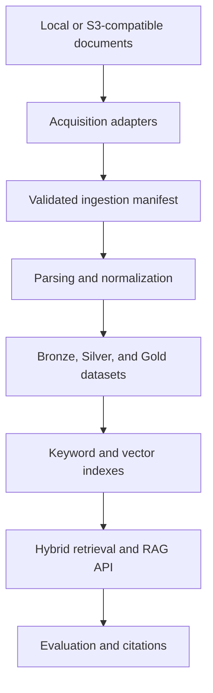

# Enterprise Document Intelligence and Hybrid RAG

A cost-safe portfolio implementation of an enterprise document-processing and
retrieval-augmented generation platform designed for AWS and Databricks
workloads.

**Development version:** `0.1.0.dev0`

## Overview

This project demonstrates the engineering foundations of an enterprise
document-intelligence platform. It is being developed incrementally from a
fully local ingestion pipeline toward governed document processing, Delta
datasets, hybrid retrieval, grounded generation, and measurable RAG quality.

The current implementation discovers local enterprise documents, generates
stable document and version identities, preserves authorization metadata, and
writes validated ingestion manifests for downstream processing.

Only synthetic documents are included. No customer, employer, or confidential
data is used.

## Current capabilities

Phase 1 currently provides:

- Typed Pydantic contracts for document metadata and source locations
- Local discovery of PDF, DOCX, CSV, TXT, JPEG, and PNG files
- Streaming SHA-256 calculation without loading complete files into memory
- Stable document identities scoped by source
- Content-dependent document version identities
- UTC-aware creation and modification timestamps
- Access-group metadata for future retrieval authorization
- Deterministic document ordering
- Recoverable per-document failure records
- Validated ingestion manifests
- Safe JSON manifest persistence
- Explicit overwrite protection
- Installed `document-rag` command-line interface
- Synthetic policy and document-register examples
- Strict static analysis and automated tests

AWS and Databricks adapters are planned but are not yet implemented.

## Architecture direction



The local and cloud adapters will share the same typed ingestion boundary.
This allows the project to develop and test its core behavior without requiring
paid cloud infrastructure.

## Zero-cost development policy

This project has a strict zero-cost cloud requirement.

- Local development uses free and open-source tools.
- Synthetic documents are used exclusively.
- Databricks work must remain within Free Edition capabilities.
- AWS experiments must remain within an available free plan or local emulator.
- No paid account upgrade is required.
- No cloud resource may be created without an explicit cost review.
- Credentials, account identifiers, tokens, and secrets must never enter Git.
- Generated artifacts are excluded from version control.

Databricks Free Edition does not support every production deployment pattern.
Where a direct cloud integration is unavailable, the project uses compatible
local adapters while documenting the equivalent production architecture.

## Requirements

- Python 3.11 or 3.12
- Git
- PowerShell, Bash, or another supported terminal

No AWS or Databricks account is required for the current phase.

## Installation

Create and activate a virtual environment, then install the project with its
development dependencies:

```bash
python -m venv .venv
python -m pip install --upgrade pip
python -m pip install -e ".[dev]"
```

On Windows PowerShell, activate the environment with:

```powershell
.\.venv\Scripts\Activate.ps1
```

## Local ingestion demonstration

The repository includes two synthetic enterprise documents:

- `data/synthetic/policies/access-control-policy.txt`
- `data/synthetic/registers/document-register.csv`

Generate a validated ingestion manifest:

```bash
document-rag ingest-local data/synthetic \
  --output artifacts/synthetic-ingestion-manifest.json \
  --source-id northstar-synthetic-documents \
  --access-group engineering \
  --access-group security
```

PowerShell equivalent:

```powershell
document-rag ingest-local `
    data\synthetic `
    --output artifacts\synthetic-ingestion-manifest.json `
    --source-id northstar-synthetic-documents `
    --access-group engineering `
    --access-group security
```

Expected summary:

```text
Source: northstar-synthetic-documents
Documents: 2
Failures: 0
```

The generated JSON contains:

- Manifest identity
- Source identity and source-system type
- Document and version identities
- Relative source URI
- Document format and media type
- File size and SHA-256 content hash
- UTC timestamps
- Access groups
- Processing status
- Recoverable ingestion failures

Existing manifests are not overwritten by default. Use `--overwrite` only when
replacement is intentional.

## Development validation

Run the complete local quality gate:

```bash
python -m ruff check .
python -m ruff format --check .
python -m mypy
python -m pytest --cov --cov-report=term-missing
python -m bandit -q -r src
python -m build
```

The CI workflow runs on Windows and Ubuntu with Python 3.11 and 3.12. It checks
linting, formatting, strict typing, tests, coverage, security scanning, and
distribution builds.

## Planned phases

### Phase 1 — Ingestion foundation

- Typed document and source contracts
- Deterministic local discovery
- Stable document and version identities
- Validated ingestion manifests
- JSON persistence
- Local ingestion CLI
- Synthetic enterprise documents

### Phase 2 — Document processing

- TXT and CSV extraction
- PDF and DOCX parsing
- OCR fallback design
- Normalized document records
- Chunking with document and page traceability
- Duplicate-content handling

### Phase 3 — Lakehouse representation

- Bronze, Silver, and Gold schemas
- Delta-compatible local development
- Databricks notebook and job examples
- Incremental processing semantics
- Data-quality evidence

### Phase 4 — Retrieval

- Keyword retrieval baseline
- Vector retrieval
- Metadata and access-group filtering
- Hybrid retrieval
- Optional reranking
- Retrieval evaluation using Recall@K and MRR

### Phase 5 — Grounded RAG

- FastAPI query service
- Evidence-based answers
- Document and page citations
- Insufficient-evidence refusal
- Groundedness and citation evaluation
- Operational logging and monitoring

### Phase 6 — Cloud adapters

- AWS S3-compatible source adapter
- Least-privilege IAM design
- Databricks ingestion adapter
- Secrets-management documentation
- Cost controls and deployment safeguards

## Engineering principles

- Preserve source traceability.
- Keep document identities stable across content changes.
- Treat each content change as a distinct document version.
- Enforce authorization metadata before retrieval.
- Isolate cloud-specific behavior behind typed interfaces.
- Measure retrieval independently from generation.
- Prefer deterministic processing where possible.
- Reject silent data loss and uncontrolled overwrites.
- Keep the complete portfolio workflow reproducible without paid services.

## Project status

Phase 1 is feature-complete on the current development branch and is being
prepared for review.
